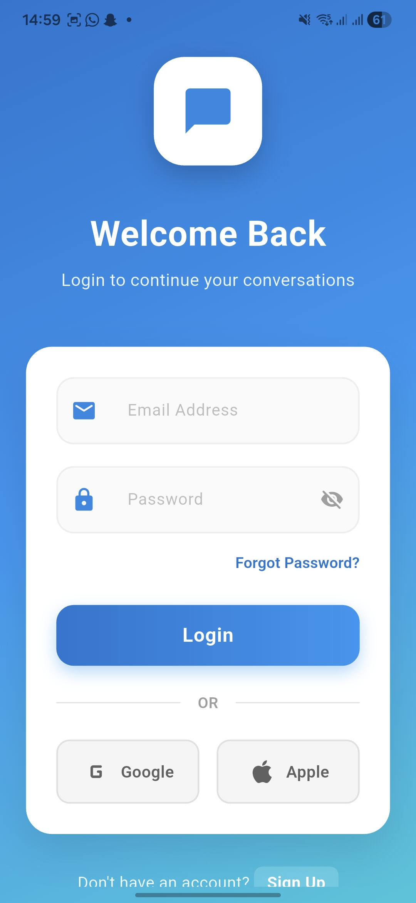
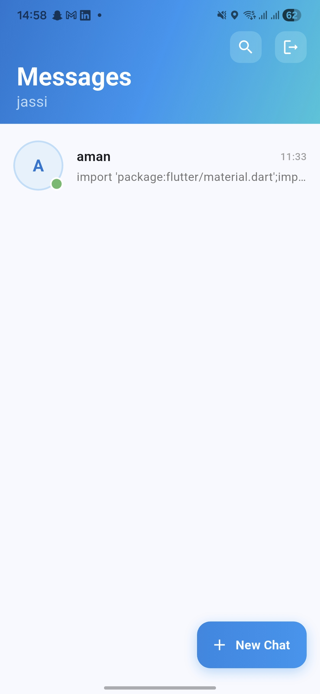
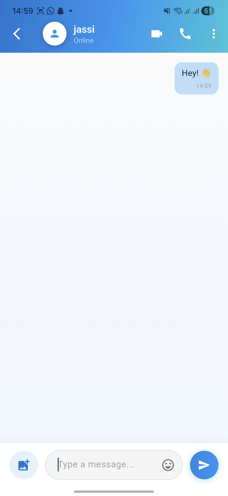
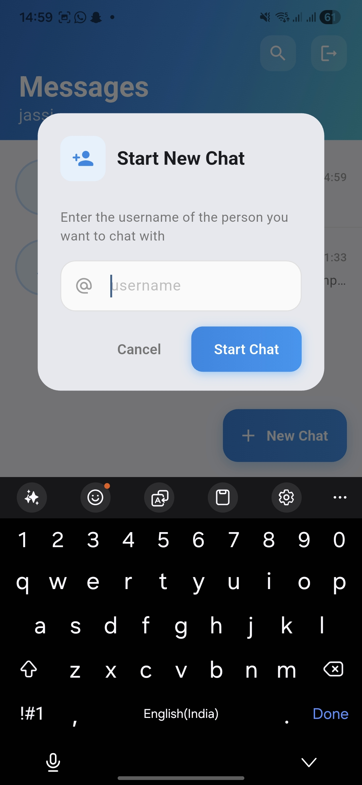

# Echo - Real-Time Chat App

Echo is a modern real-time chat application built with Flutter.

It combines Firebase for authentication and messaging with Supabase Storage for media handling, demonstrating a hybrid backend architecture.

---

# 🧠 AI Integration

Echo AI is triggered when chatting with echo_ai.

Flow:

User message stored in Firestore

Temporary typing message added

Last 10 chat messages sent to Groq API

AI response stored back in Firestore

Chat metadata updated

Model used:

llama-3.1-8b-instant via Groq

This demonstrates:

LLM integration in Flutter

Conversation history handling

System + user role formatting

Error fallback logic

---

## 🚀 Features

- Firebase Authentication
- Real-time messaging with Cloud Firestore
- Image messaging via Supabase Storage
- Anonymous Supabase session handling
- Clean modern UI with SliverAppBar design
- Conversation metadata tracking
- Username-based chat initiation

---

## 🏗 Architecture

Frontend:
- Flutter (Dart)

Backend Services:
- Firebase Auth (user authentication)
- Firebase Firestore (real-time chat database)
- Supabase Storage (media storage)

Design Choice:
Text data is stored in Firestore for real-time sync.
Media is stored in Supabase Storage for scalable object handling.

This separation demonstrates multi-service backend integration.

---

## 📂 Project Structure

lib/
- screens/
- widgets/
- services/

---

## 🔐 Environment Setup

Create a `.env` file in root:

GROQ_API_KEY=your_groq_key
SUPABASE_URL=your_url
SUPABASE_ANON_KEY=your_key

---

## 📸 Screenshots

### 🔐 Authentication

  
  

### 💬 Chat List

  

### 📩 Chat Screen (Text + Image)

  

### ➕ Start New Chat

  

---

## 🧠 Why This Project Matters

This project demonstrates:
- Real-time systems
- Cross-service integration
- State management in Flutter
- Backend rule handling
- Production-style folder structure

---

## 📌 Future Improvements

- Read receipts
- Online presence tracking
- Push notifications
- Message reactions
- End-to-end encryption

---

## 👨‍💻 Author

Built by Jasdeep Singh
